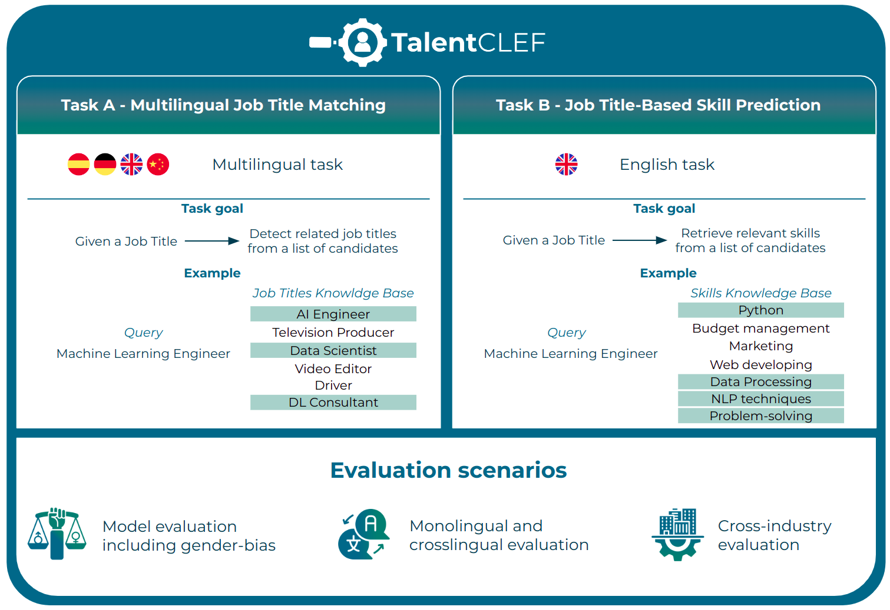

The first edition of TalentCLEF aims to develop and evaluate models designed to facilitate three essential tasks: 

1. Finding/ranking candidates for job positions based on their experience and professional skills.
2. Implementing upskilling and reskilling strategies that promote the coninuous development of workers
3. Detecting emerging skills and skills gaps of importance in organizations. 

