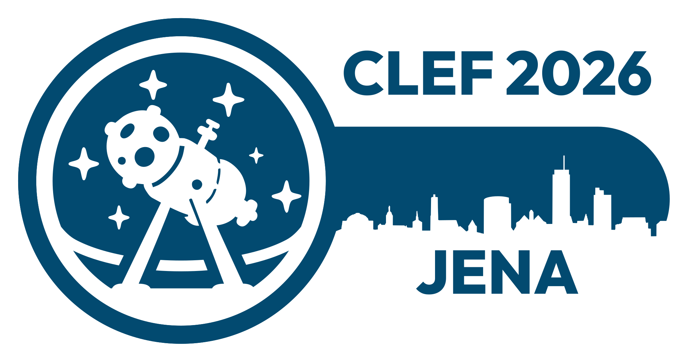
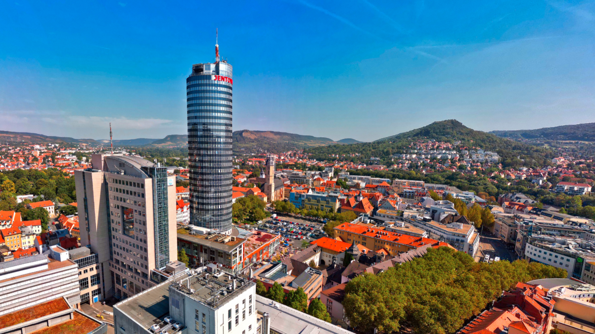

## TalentCLEF Workshop @ CLEF 2026

TalentCLEF 2026 workshop will be held as part of the CLEF 2026 conference (Conference and Labs of the Evaluation Forum), scheduled for September in Jena, Germany.  

### About the Workshop
The TalentCLEF evaluation Lab will be a one-day event that will include several activities. There will be oral presentations of the best challenge solutions, keynote talks, a poster session for participants and a panel discussion. In order to boost participation, an awards ceremony will be held where diplomas will be awarded to the best performing teams. Below is a tentative schedule of the workshop activities.

### About the Workshop
The TalentCLEF evaluation Lab will be a one-day event that will include several activities. There will be oral presentations of the best challenge solutions, keynote talks, a poster session for participants and a panel discussion. In order to boost participation, an awards ceremony will be held where diplomas will be awarded to the best performing teams. Below is a tentative schedule of the workshop activities.

CLEF focuses on evaluating the effectiveness of information retrieval systems, such as search engines, text and multimedia retrieval systems, and other types of digital information systems. 

Participants in the TalentCLEF workshop are required to submit a short paper detailing the systems they have developed for the task. Accepted submissions will be published in the CLEF 2026 CEUR proceedings.

At least one author from each accepted paper must register for the CLEF conference and present their system in a poster format. Additionally, outstanding participants, selected by the program committee, will have the opportunity to deliver an oral presentation of their work.
