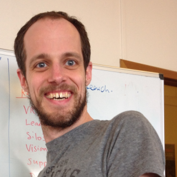

  

    
  

  

    <h2 style="margin-top: 0;">Toine Bogers</h2>
    

      Associate Professor, IT University of Copenhagen 
      NEtwoRks, Data &amp; Society (NERDS) research group, Data Science section 
      Chief Scientific Officer, Pioneer Centre for AI
    

    

      <a href="http://toinebogers.com/" target="_blank"><i class="fas fa-globe"></i> Personal website</a>
      <a href="https://scholar.google.com/citations?user=zgPK5UAAAAAJ&hl=en" target="_blank"><i class="fas fa-graduation-cap"></i> Google Scholar</a>
    

  

## Talk

**Title — to be announced**

## Abstract

*To be completed.*

## Short bio

Toine Bogers is an associate professor at the IT University of Copenhagen, where he is a member of the NEtwoRks, Data & Society (NERDS) research group in the Data Science section, and Chief Scientific Officer of the Pioneer Centre for AI. His research applies information access technologies—such as recommender systems and search engines—to unlock large information collections, combining system-centered ("How can we develop better algorithms?") and user-centered ("How do users interact with them?") perspectives. He focuses particularly on responsible applications in the HR domain, with significant experience modeling skills and expertise using large language models, including job recommendation and expert search.

  <a href="/talentclef/docs/talentclef-2026/workshop/workshop_schedule" class="btn btn-primary btn-lg">Back to the Schedule</a>

