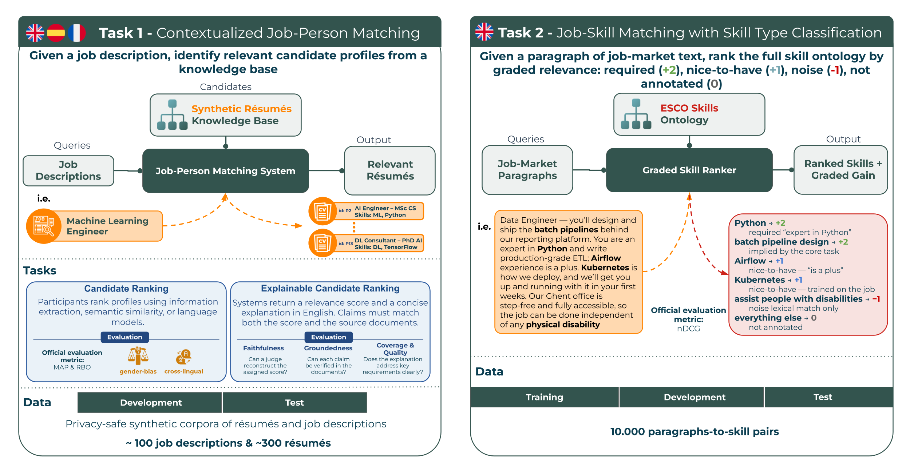

The third edition of TalentCLEF continues the goal of advancing models for key HCM tasks, such as finding and ranking candidates for job positions based on their experience and skills. Building on the lessons learned from the first two editions, **TalentCLEF 2027 is structured into two tasks**, the first of them divided into two subtasks:

#### **Task 1: Contextualized Job-Person Matching**

Traditionally, job–candidate matching has relied on comparing isolated entities (skills or job titles extracted from résumés and job descriptions), often without considering the broader context in which they appear. Task 1 focuses on identifying relevant candidates for a given job offer using realistic, context-rich descriptions of both postings and profiles, synthetically generated from structured resources without any personal information; as a result, there are no privacy risks associated with the data.

Task 1 builds on TalentCLEF 2026's Task A, retaining candidate ranking as Subtask 1.1 and adding a new explainability layer as Subtask 1.2.

- **Subtask 1.1 – Candidate Ranking**

  **Goal**: For each job description, participants provide a ranked list of candidate profiles by relevance to the position, using approaches such as information extraction, semantic similarity, or large language models.

  **Settings**: We retain the three settings of the 2026 edition: *monolingual*, *cross-lingual*, and *bias* (ranking stability across demographic groups on otherwise-equivalent candidates).

  **Novelties**: An expanded test set covering more industries and different profiles, and a new language in the corpus (**French**), in addition to English and Spanish.

  **Evaluation**: The official metric is **Mean Average Precision (MAP)**, with Mean Reciprocal Rank (MRR), Precision@K (1, 5, 10) and NDCG (if judgments become graded) also reported. Bias is diagnosed via Rank-Biased Overlap (RBO) between counterfactual candidate pairs. More details will be published in the <a  href=''>Evaluation page</a>.

- **Subtask 1.2 – Explainable Candidate Ranking**

  **Goal**: Beyond deciding who fits a position, systems must justify why. For each ranked job–candidate pair, participants output a relevance score on a fixed scale together with a length-capped explanation in English, optionally accompanied by a structured list of the requirements the candidate does and does not meet. Explanations will be required only for each system's top-k candidates rather than for the full ranking.

  **Evaluation**: Explanations are evaluated along four axes:

    - *Faithfulness*: whether the explanation is consistent with the assigned score, measured by having an LLM judge reconstruct the score from the explanation alone.
    - *Groundedness*: whether each individual claim can be verified against the source documents.
    - *Evidence coverage*: how many of the annotated key requirements the explanation actually mentions.
    - *Intrinsic quality*: a rubric-based assessment by human annotators, extended with a validated LLM judge.

  Faithfulness and groundedness are the headline metrics, because they are the hardest to satisfy through polished writing alone: a fluent explanation still scores poorly unless it is genuinely consistent with the score and supported by the source documents. To prevent LLM judges from favoring explanations produced by their own model family, we ensemble judges across families and release the judge prompts only after evaluation closes.

  Because every submission includes the numeric scores, each Subtask 1.2 participant is also evaluated under Subtask 1.1, letting us measure whether generating explanations helps or hurts ranking quality, an effect we call the *"explainability tax"*.

#### **Task 2: Paragraph-to-Skill Ranking under Negation**

Skill extraction, which maps free text such as a job posting or résumé onto a standardized competency ontology like ESCO, is the backbone of every downstream HCM application: candidate ranking, internal mobility, skill gap analysis, and workforce planning. Current benchmarks share a common and rarely questioned assumption: that a skill mentioned in the text is a skill that is required or possessed. In practice, natural job-market language is full of counter-examples. A vacancy may explicitly exclude a skill, defer it to on-the-job training, or reassign it to a tool or a teammate. The surface form of the skill is present, but its polarity is inverted or nullified. A system that treats every mention as positive will systematically over-predict skills, degrading precision in exactly the cases where the writer took care to be explicit.

**Goal**: Given a short paragraph of job-market text, systems must rank the full skill ontology, scoring each candidate skill not merely by relevance but by its **polarity** in the paragraph. Each skill takes one of three graded-relevance values:

- **positive (+1)**: the text requires or ascribes the skill.
- **negative (−1)**: the text mentions the skill but inverts, defers, delegates, or excludes it.
- **neutral (0)**: the residual grade, covering every one of the roughly 13,890 ESCO skills the paragraph neither requires nor negates.

The task is deliberately difficult: the same skill string can appear under different polarities, and the distinction lives entirely in the surrounding context rather than in the mention itself. It is not reducible to negation detection — a delegation such as *"Python work is handled entirely by our platform team"* carries no negation cue at all, yet should score −1, since the candidate is explicitly relieved of the skill. This connects the task to a mature but largely separate line of NLP research on negation cue and scope detection which, to our knowledge, has never been integrated into ontology-grounded skill ranking.

**Evaluation**: Because the output is a ranking of the entire skill ontology against a single paragraph, evaluation uses **normalized discounted cumulative gain (nDCG)**, the standard graded-relevance metric for ranked retrieval and one already familiar from adjacent skill-prediction benchmarks. The novelty lies in the polarity-based gain scale: a system that ranks a negated skill highly is penalized, which is precisely the behavior we wish to discourage. Because negative gains leave raw nDCG unbounded below, we normalize over the signed gains so that scores remain in [0, 1], with the ideal signed ordering at 1.

Task 2 is also a natural external contribution to WorkRB, TechWolf's community-driven evaluation framework for AI in the work domain.
