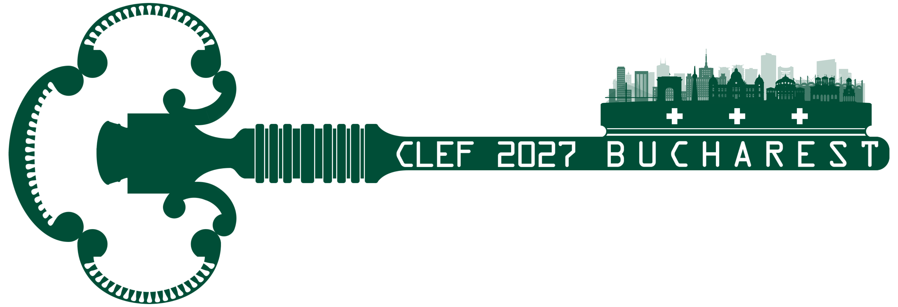

## TalentCLEF Workshop @ CLEF 2027

TalentCLEF 2027 workshop will be held as part of the CLEF 2027 conference (Conference and Labs of the Evaluation Forum), hosted by the National University of Science and Technology Politehnica Bucharest, Romania, from 14 to 17 September 2027.

### About the Workshop
The TalentCLEF evaluation Lab will be a one-day event that will include several activities. There will be oral presentations of the overview results of each task, oral presentations of participating teams covering the best challenge solutions, one keynote talk and a poster session for participants. In order to boost participation, an awards ceremony will be held where diplomas will be awarded to the best performing teams, followed by a general discussion and the roadmap for the 2028 edition. The tentative schedule of the workshop activities will be published on this page closer to the conference.

CLEF focuses on evaluating the effectiveness of information retrieval systems, such as search engines, text and multimedia retrieval systems, and other types of digital information systems. 

Participants in the TalentCLEF workshop are required to submit a short paper detailing the systems they have developed for the task. Accepted submissions will be published in the CLEF 2027 CEUR proceedings.

At least one author from each accepted paper must register for the CLEF conference and present their system in a poster format. Additionally, outstanding participants, selected by the program committee, will have the opportunity to deliver an oral presentation of their work.
